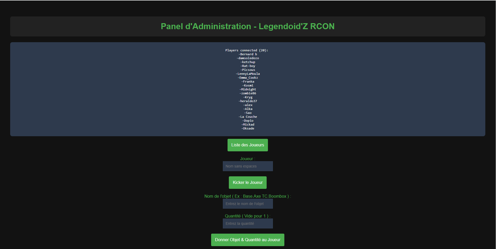

# Legendoidz_HTML
HTML Management Panel for Project Zomboid Game Server

To set up the project, run the following commands:

[1] Run npm install to install the dependencies
```bash
npm install
```

[2] Make sure to download the rcon-cli tool and add it to the same folder as server.js. You can find rcon-cli here :
https://github.com/gorcon/rcon-cli/releases/tag/v0.10.3


[3] Before running the server, don't forget to modify the values in the config.json file.

[4] Create a folder named 'public' and place 'index.html' in it

To start the server :

```bash
node server.js
```


